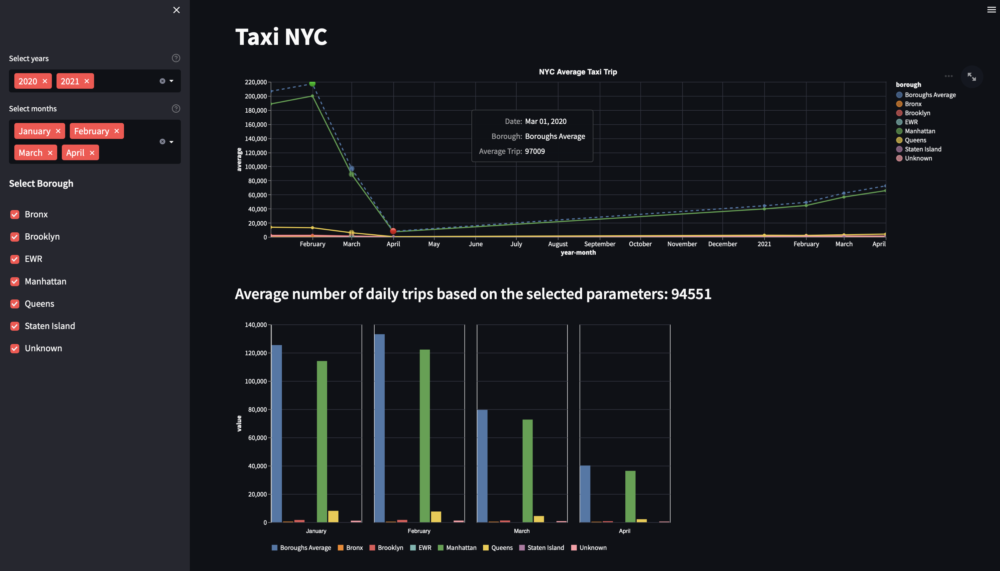
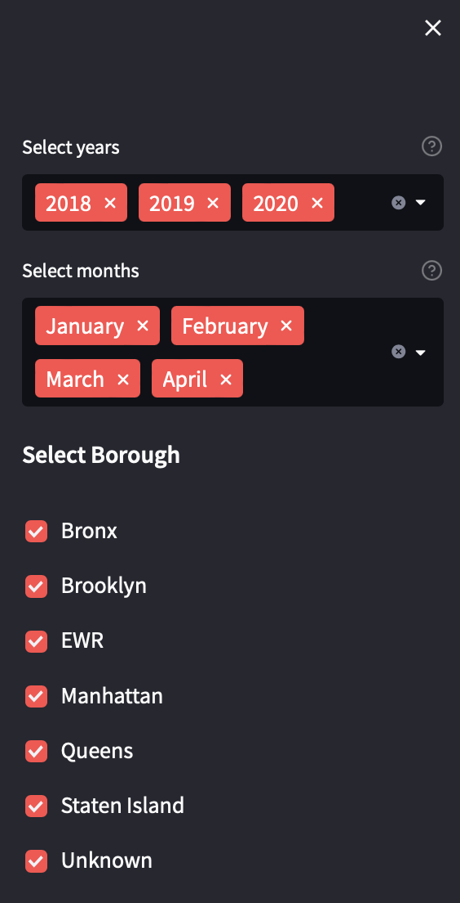
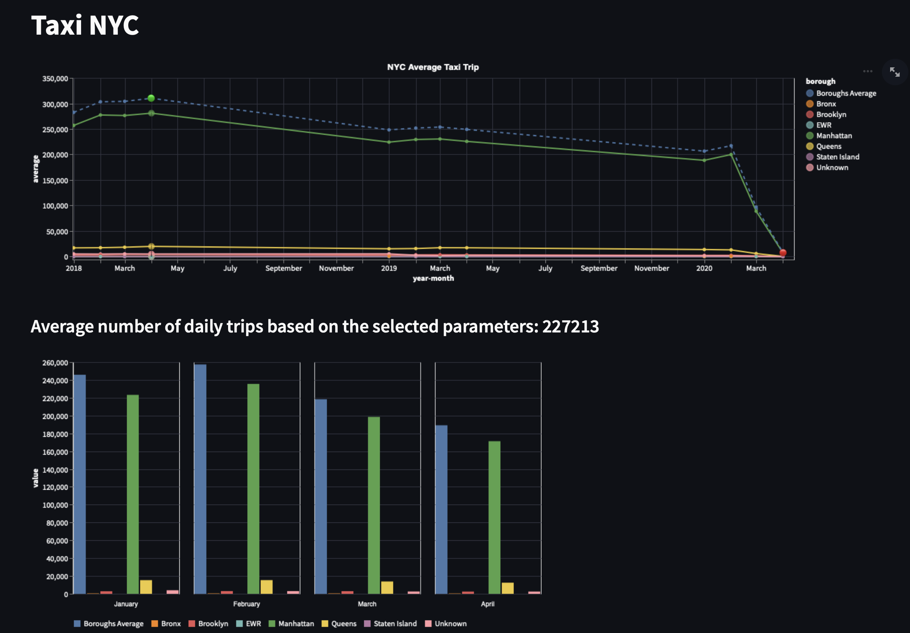

# Progetto1 Taxi NYC
Questo progetto è stato realizzato al fine di analizzare un dataset relativo alle corse effettuate dai taxi di 
NewYork in un determinato lasso di tempo con lo scopo ultimo di rispondere alle seguenti richieste:
1) Ottenere un file contenente, per ogni mese, il numero medio di viaggi giornaliero per ogni borough
2) Visualizzare in un grafico l'andamento relativo ai risultati ottenuti
3) Visualizzare quali tra i mesi hanno media massima/minima
### Running info
- Per eseguire il programma portarsi nella directory del progetto ed eseguire da terminale
    ```
    streamlit run app.py
    ```
- La prima volta che si esegue il programma verrà creata automaticamente la directory _/output_ con il file _average.csv_

#### All'avvio l'utente si troverà davanti alla seguente schermata:


#### Input
All'interno dell'interfaccia streamlit l'utente potrà inserire una serie di input relativi a: periodo da analizzare (anni e mesi) e borough da visualizzare

Di seguito si riporta un esempio di input: 


#### Output
Una volta inseriti tutti gli input desiderati il risultato verrà visualizzato come segue:



Nel line-chart vengono evidenziati i mesi con media giornaliera più bassa e più alta attraverso i seguenti simboli: 🔴 , 🟢.

I seguenti grafici sono ricavati a partire da un file .csv che viene restituito come output dal programma. Il file csv avrà la seguente struttura:
```
|CSV   |year-month|borough  |average|
|------|----------|---------|-------|
|0     |2018-01   |Bronx    |238    |
|1     |2018-01   |Brooklyn |3234   |
|2     |2018-01   |EWR      |18     |
|3     |2018-01   |Manhattan|256972 |
|4     |2018-01   |Queens   |16998  |
```
#### Per la realizzazione di questo progetto sono prese le seguenti scelte: 
- Nel conteggio della media vengono considerate le corse che PARTONO da un determinato borough.
- Si verifica che i campi PULocationID e DOLocationID di ogni corsa abbiano corrispondenza nel file taxi+_zone_lookup.csv. 
- C'è possibilità di visualizzare il borough Unknown, nel senso che vengono considerate le corse che partono da borough Unknown.
- Se non si specifica l'anno si visualizzano gli ultimi 2 anni a partire dall'anno corrente, se non si specifica il mese si visualizzaon i primi 4 mesi dell'anno, se non si specificano i borough si considera tutta New York.
- Nel caso in cui l'utente selezioni almeno un periodo i cui risultati non sono presenti nel csv (in memoria) fornito come output, l'interfaccia streamlit entrerà in attesa che il programma finisca di calcolare i risultati relativi agli input aggiuntivi; questi ultimi verranno aggiunti al csv prima della generazione del grafico.


### Structure

Per la corretta esecuzione del programma è necessario che il dataset sia archiviato in una directory denominata 'data' secondo la seguente struttura:

```
.
├── data
│   ├── trip
│   │   ├── ...
│   │   ├── 2021
│   │   │   ├── yellow_tripdata_2021-01.parquet
│   │   │   ├── yellow_tripdata_2021-02.parquet
│   │   │   └── ...
│   │   └── 2022
│   │       ├── yellow_tripdata_2022-01.parquet
│   │       └── ...
│   └── zone
│       └── taxi+_zone_lookup.csv
├── Analisi
│   ├── __init__.py
│   └── DataAnalyses.py
├── File
│   ├── __init__.py
│   ├── TaxiTripFile.py
│   └── TaxiZoneFile.py
├── FileMaker
│   ├── __init__.py
│   └── AverageFileMaker.py
├── output
│   └── average.csv
├── utils_app
│   ├── __init__.py
│   ├── util_analyses.py
│   ├── util_barChart.py
│   ├── util_chart.py
│   ├── util_dataset.py
│   ├── util_filter.py
│   └── util_mean.py
├── .gitignore
├── README.md
├── app.py
├── delete.py
└── requirements.txt
```